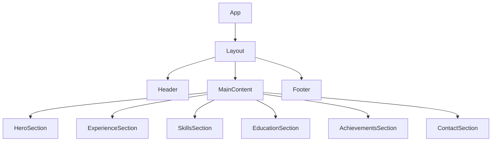
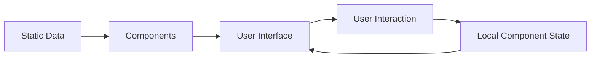

# System Patterns: Alifiya Parekh Professional Website

## Architecture Overview
The website is structured as a single-page React application with component-based architecture. The design follows a modular approach for maintainability and scalability.

## Component Structure
1. **Layout Components**
   - Header: Navigation and site identity
   - Footer: Contact information and links
   - Layout: Wrapper for all content with common styling

2. **Section Components**
   - HeroSection: Introduction and personal brand statement
   - ExperienceSection: Professional history and work experience
   - SkillsSection: Technical and soft skills relevant to medical devices
   - EducationSection: Academic background and qualifications
   - AchievementsSection: Notable accomplishments and certifications
   - ContactSection: Contact form and information

## Design Patterns
1. **Component Composition**
   - Each section is a self-contained component
   - Reusable UI elements shared across components
   - Single responsibility principle for component design

2. **State Management**
   - Local component state for UI interactions
   - No complex global state required (simple website structure)

3. **Responsive Design Pattern**
   - Mobile-first approach
   - Flexible layouts using CSS Grid and Flexbox
   - Breakpoints for different device sizes

## Styling Approach
1. **Modular CSS**
   - Component-specific CSS files
   - Consistent naming convention
   - CSS variables for theming

2. **Typography System**
   - Consistent type scale
   - Limited font variations
   - Accessible text sizes and contrasts

## Data Flow

The application primarily uses static data as it's a portfolio/resume site. User interactions (such as form submissions in the contact section) will be handled with local state.

## Performance Considerations
1. **Image Optimization**
   - Optimized image assets
   - Lazy loading for below-the-fold content
   
2. **Code Organization**
   - Component code splitting
   - Efficient rendering practices

## Accessibility Patterns
1. **Semantic HTML**
   - Proper heading hierarchy
   - ARIA attributes where needed
   - Meaningful alt text for images

2. **Keyboard Navigation**
   - Logical tab order
   - Focus indicators

## SEO Approach
1. **Metadata**
   - Descriptive page titles and meta descriptions
   - Structured data for professional information
   
2. **Content Optimization**
   - Keyword-rich headings and content
   - Semantic structure
